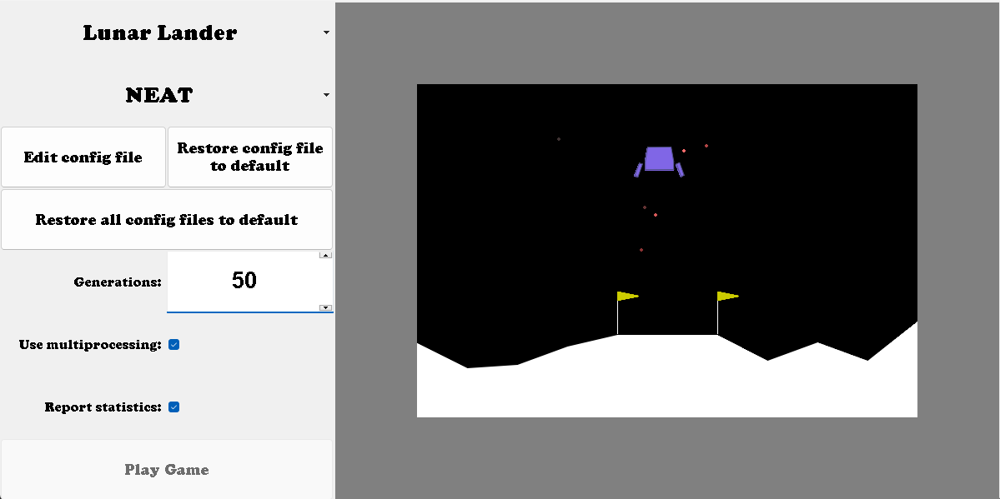

## Project Name
Evolving neural networks using different neuroevolution methods to solve gymnasium environments

## Description
This program provides a simple GUI that allows the user to choose an environment and an algorithm, and to edit the algorithm's hyperparameters. The evolution can then be started by one button press and once the algorithm is trained, the user can view a game played by the algorithm in the environment. 

## Requirements
To install all needed prerequisites, all you have to do is run `pip install -r requirements.txt`

## How to use the program
To learn how to use the program, refer to the [User's documentation](./docs/user.md)

## How to edit the program
To learn how the program is structured, refer to the [Programmer's documentation](./docs/programmer.md)

### Author
Marko Hlavatý

### Background
This is my second-semester project for my programming class. We were allowed to choose our own theme, so I picked neuroevolution because the subject fascinates me, and I wanted to learn more about it.

### Support
If you have any questions or comments about the project, send me an email at marko.hlavaty@gmail.com
