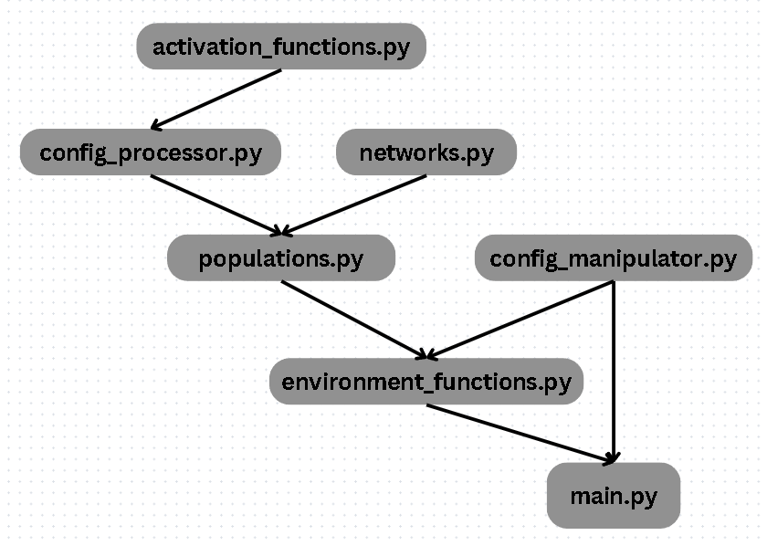

This file gives an overview of the modules of the program and how they are imported into one another. At the end, there is a section that outlines how to add environments and algorithms to the program. 

# Modules
Below is an overview of the seven modules that make up the program. Below each module are listed all functions and classes that are in that module. Additionaly, every function / class / method has a brief description next to it and sometimes there are explanations at the end the description of a module. Description of classes / methods / functions are taken directly from the program docstrings. 

## main.py
This is the main module of the whole program that implements the GUI.

The GUI is implemented in tkinter, and functions that are assigned to widgets but are not related to the GUI are imported from other modules of this program.

In order for the user to be able to use the GUI window while an algorithm is being trained, the training function is implemented in such a way that it runs on a different thread.

#### MainWindow
Class that implements the main GUI window with a sidebar and tkinter Canvas

##### \_\_init__
Calls the __init__ method of parent class tkinter.Tk, sets the class variables, calls _render_gui_elements to render window widgets and starts the main loop

##### _render_gui_elements
Initializes all of the window widgets, calls _draw_sidebar to render the sidebar widgets and renders the Canvas

##### _draw_sidebar
Takes a list of tuples of widgets as argument and renders the widgets in rows on the sidebar

##### _display_message
Clears the canvas and displays a text message in the middle of it

##### _render_game
Creates a new game, calls a generator that yields frames that are rendered in the Canvas

##### play_game
Disables the main button and renders a game with the evolved network

This method is called when "Play Game" button is pressed

##### _wait_for_training
Periodically checks for whether the algorithm is being trained

Once it is trained, it lets the user know and enables a button to play a game with the evolved network

This method is called periodically while algorithm is being trained

##### _train_algorithm
Calls function evolve_network from module environment_functions in order to evolve a network to solve the given game

Puts the network in Queue so the main thread can access it

##### run_training
Starts training the algorithm in a different thread and calls _wait_for_training to periodically check for whether the training has finished

This method is called when "Train" button is pressed

##### edit_config
Opens config file corresponding to the given environment and algorithm in the default text editor

The command is based on the user's operating system

##### restore_config
Calls function restore_default_config from module config_manipulator to reset config file that corresponds to the given environment and algorithm to default

### How the functions are called:
(MainWindow is initialized) -----> \_\_init__ is called -----> _render_gui_elements is called from \_\_init__ -----> _draw_sidebar is called from _render_gui_elements is called from \_\_init__

(User presses the "Train" button) -----> run_training calls _train_algorithm in a different thread and also calls _wait_for_training to keep track of whether the training has already finished

(The training has finished) -----> (User presses the "Play Game" button) -----> play_game is called -----> _render_game is called from inside of play_game

## config_manipulator.py
This module contains functions that can be used for manipulation with config files

##### get_config_file_path
Assembles and returns config file path corresponding to given environment and algorithm

Raises an exception if the file does not exist

##### restore_default_config
Restores config file corresponding to given environment and algorithm

Default config file is taken from default_config_files directory

##### restore_all_default_configs
Restores all config files

Default config files are taken from default_config_files directory

## environment_functions.py
This module contains functions to interact with the training environment

It also contains a custom fitness function for each environment and a dictionary where all fitness functions can be accessed by the environment's string name

##### acrobot_fitness_function
Fitness function that evaluates a network's performance in Acrobot

The final fitness is the highest point that was reached minus a constant times the number of time steps that it took

The function returns fitness as a float

##### cart_pole_fitness_function
Fitness function that evaluates a network's performance in Cart Pole

The final fitness is the number of time steps that the pole was kept balanced

The function returns fitness as a float

##### mountain_car_fitness_function
Fitness function that evaluates a network's performance in Mountain Car

The final fitness is the furthest point that was reached (to the right) minus a constant times the number of time steps that it took

The function returns fitness as a float

##### lunar_lander_fitness_function
Fitness function that evaluates a network's performance in Lunar Lander

The final fitness is the cumulative reward that was obtained from the environment processed so that the value is always non-negative, averaged over a certain number of evaluations

The function returns fitness as a float

###### fitness_functions
A dictionary where all of the above fitness functions can be accessed using their string names

##### evolve_network
Creates and evolves a population of networks based on the input parameters

Returns the most fit network at the end of the last iteration of the evolution

##### render_game
Generates and yields frames from specified game that is played by network that is passed as input

Yields 3d array that represents RGB image of the game while the game is running

Yields None once when the game stops

### Note:
Constants in fitness functions in this module are chosen so that the resulting fitness is non-negative. You can look at them as you would look at formulas. 

## populations.py
This module contains implementations of evolutionary algorithms used to train neural networks

For every algorithm, there is an object representing a population of individuals that can be trained using that algorithm

All population objects inherit from class NeuralNetworkPopulation for consistency

There is also a dictionary where all population classes can be accessed using the algorithm's string name

#### NeuralNetworkPopulation
Abstract class that all populations inherit from

##### train
Trains the population for specified number of generations using provided fitness function

##### fit
Can be used as an alternative to train

##### get_winning_network
Returns the fittest network that has been found

Raises an exception if the population has not been trained yet

##### \_\_str__
Returns a string with information about the population

Is called when an instance of the class is converted to string

#### NEATTypePopulation
Class that NEATPopulation and HyperNEATPopulation2D inherit from that contains all of their shared parts

#### NEATPopulation
Class that represents a population of neural networks that can be trained using NEAT algorithm

#### HyperNEATPopulation2D
Class that represents a population of neural networks that can be trained using HyperNEAT algorithm

#### CMAESNetworkPopulation
Class that represents a population of fixed topology neural networks that can be trained using CMA-ES algorithm

#### DifferentialEvolutionNetworkPopulation
Class that represents a population of fixed topology neural networks that can be trained using differential evolution

###### populations
A dictionary where all of the above populations can be accessed using their string names

### Note:
For more detailed information about the organization of the individual classes, refer directly to the module itself. It contains more documentation. 

## networks.py
This module contains implementations of neural networks needed for the neuroevolution algorithms

The networks are represented as objects, all networks inherit from NeuralNetwork class for consistency

#### NeuralNetwork
Abstract class that all networks inherit from

##### \_\_call__
Returns output of the network that corresponds to the given input

##### activate
Can be used as an alternative to \_\_call__

##### predict
Can be used as an alternative to \_\_call__

##### __str__
Returns a string with information about the network

Is called when an instance of the class is converted to string

#### HyperNEATNetwork2D
Class that represents a HyperNEAT network and inherits from NeuralNetwork class in order to be consistent with other types of networks

#### FixedTopologyNetwork
Class that represents a fixed topology neutral network and inherits from NeuralNetwork class in order to be consistent with other types of networks

### Note:
For more detailed information about the organization of the individual classes, refer directly to the module itself. It contains more documentation. 

## config_processor.py
This module contains functions that extract information from
config files and dataclasses that store this information

#### FixedTopologyNetworkConfig
Dataclass that holds information about a fixed topology network

#### CMAESPopulationConfig
Dataclass that holds information about an instance of CMA-ES algorithm

#### DifferentialEvolutionConfig
Dataclass that holds information about an instance of Differential Evolution algorithm

#### extract_value
Extracts value corresponding to a given name from a given config file and tries to return it as specified type

Raises an exception when the item is not listed or if it is listed more than once

An exception is also raised is the listed value cannot be converted to the specified type

#### check_line_name
Checks for name of the variable that is in the given string, returns True if at least one of the specified names is the string variable name

Names can be either a string (one name) or a list of strings (multiple names)

#### create_hyperneat_substrate_config
Creates and returns FixedTopologyNetworkConfig for HyperNEAT substrate based on the given config file

#### create_hyperneat_cppn_config
Creates and returns config for HyperNEAT CPPN that is evolved by NEAT algorithm based on the specified config file

#### create_neft_network_config
Creates and returns FixedTopologyNetworkConfig for fixed topology neural network based on the given config file

#### create_cmaes_config
Creates and returns CMAESPopulationConfig for CMA-ES algorithm based on the given config file

#### create_de_config
Creates and returns DifferentialEvolutionConfig for differential evolution based on the given config file

## activation_functions.py
This module contains implementations of basic activation functions and a dictionary that allows for retrieval of a function using its string name

It contains these activation functions: abs, cube, exp, identity, relu, log, sigmoid, sin, softplus, square and tanh

# Imports
Below is an image of how the modules are imported into each other. There is an arrow between two modules if any part of one is imported into the other. 

## How to add a new environment
In order to add a new environment, you have to:
* add a new config function that evaluated a network's performance in the environment (in environment_functions.py)
* add the environment to the environment_names dictionary (in environment_functions.py)
* create a folder in default_config_files, name it by the environment's string name, and add config files for all algorithms for that environment
* copy the folder to config_files (so now there are two copies, one in default_config_files and the other one in config_files)

## How to add a new algorithm
In order to add a new algorithm, you have to:
* if needed, create a new config dataclass and function that extracts data from a config file and returns that dataclas (in config_processor.py)
* if needed (if the algorithm does use a regular fixed topology network), create a new network class in networks.py - this class should inherit from NeuralNetwork for consistency and completeness
* create a new population class in populations.py - this class should inherit from NeuralNetworkPopulation for consistency and completeness
* add the population to the populations dictionary (in populations.py)
* in default_config_files, create a file in every environment's folder and call it by the population's string name
* put the newly created config files in config_files folder in the same place (folders default_config_files and config_files have the same structure)
